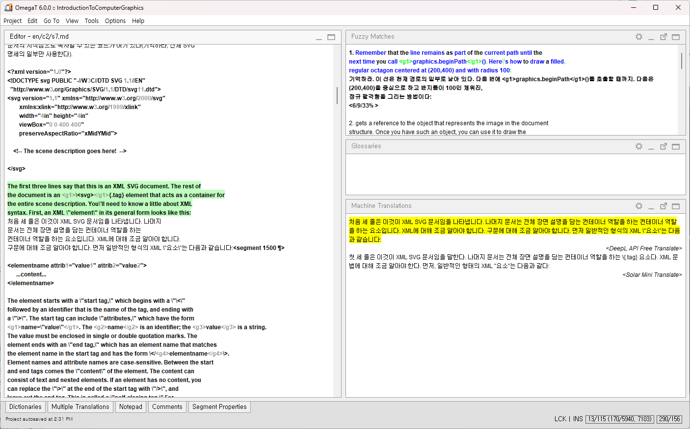

# DeepL API Free Plug-in for OmegaT

This plugin enables users to use DeepL API v2 with DeepL API Free plan in OmegaT CAT environment.



This plug-in is based on [Solar Mini Translate plug-in for OmegaT](https://github.com/ychoi-kr/omegat-plugin-solar-mini-translate).
This software is open source software licensed under the GNU GPLv2. In addition, as a special exception, the copyright holders of this program give you permission to combine the program with free software programs or libraries that are released with code included in the standard release of [JSON-java Library](https://github.com/stleary/JSON-java) under the [JSON-java License](https://github.com/stleary/JSON-java/blob/master/LICENSE). You may copy and distribute such a system following the terms of the GNU GPL for this program and the licenses of the other code concerned. For detailed information, please refer to the LICENSE file.

## How to use

0. Get your *free* API key from [DeepL](https://www.deepl.com/ko/pro#developer).

1. Copy the plug-in file into directory:

    - First, download the plug-in file (.jar) from [here](https://github.com/ychoi-kr/omegat-plugin-deepl-api-free-translate/releases).
   
    - Windows: Copy the downloaded plug-in file into %SystemDrive%%ProgramFiles%\OmegaT\plugins directory.
    - macOS: Copy the downloaded plug-in file into /Applications/OmegaT.app/Contents/Java/plugins directory.
    - GNU/Linux: Copy the downloaded plug-in file under the directory that OmegaT installed.

2. Set your DeepL API key.

    - Windows: Open the file %SystemDrive%\%ProgramFiles%\OmegaT\OmegaT.I4J.ini and add this line:
    ```
    -Ddeepl-api-free.api.key=YOURAPIKEY
    ```

    - macOS: Open the file /Applications/OmegaT.app/Contents/Resources/Configuration.properties with text editor and add this line:
    ```
    deepl-api-free.api.key=YOURAPIKEY
    ```
   
    - In case of running the program with command line prompt, add this parameter:
    ```
    -Ddeepl-api-free.api.key=YOURAPIKEY
    ```
   
3. Open OmegaT Application. From Options > Machine Translation, select DeepL API Free Translate.